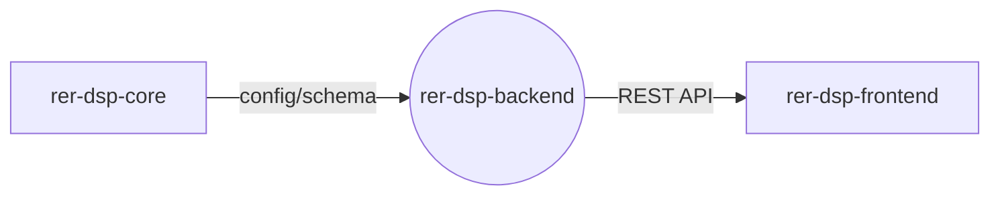

# rer-dsp-backend

> This repository is one module of the **DSP (Data Sharing Platform)**, part of the RER ecosystem.
> Full project documentation lives in **[rer-dsp-docs](https://github.com/Rural-Environmental-Registry/rer-dsp-docs)**.
> The information below covers this module only, not the DSP project as a whole.

## Where this module fits in the DSP



## Purpose

REST API that exposes environmental and geospatial data for sharing among RER partner institutions.

## Responsibilities

- Expose REST endpoints for data query and sharing
- Persist and query geospatial data (PostGIS)
- Read installation configuration generated by `rer-dsp-core`

## Technologies

Java 21, Spring Boot 3.4.2, PostgreSQL/PostGIS, Gradle.

## How to run

```bash
./gradlew bootRun
```

Or, preferably, via `rer-dsp-core` (`./start.sh`), which starts the full stack.

## License

[GNU General Public License v3.0](LICENSE)
